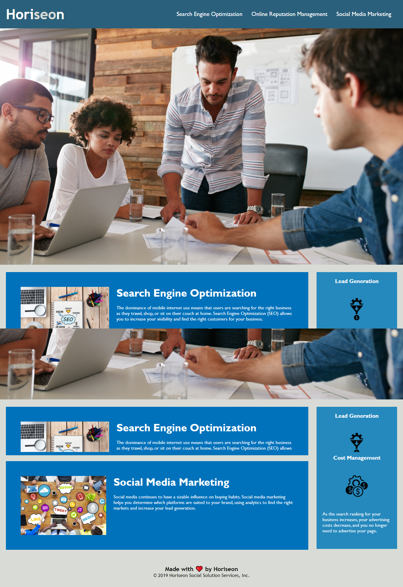

#homework1
Homework 1
Assignment goal was to clean up exisiting code with proper semantic naming structure without effecting the structure of the website
index.html
-updated website title
-updated nav main section and aside
-alt tags were added for seo and screen readers
style css 
-added comments to define what the style code was referening
link to site: http://ryanwit.github.io/homework_1
link to repo: https://github.com/ryanwit/homework_1
